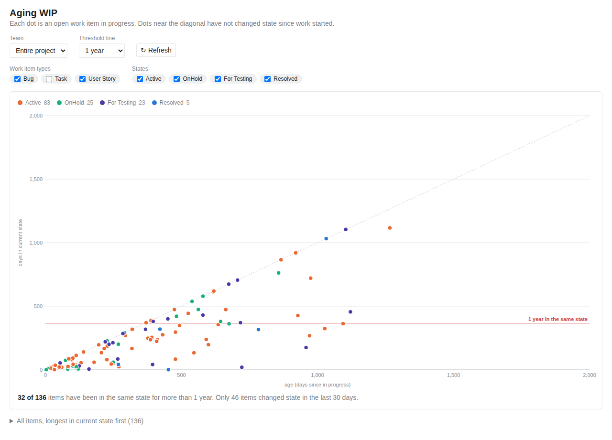
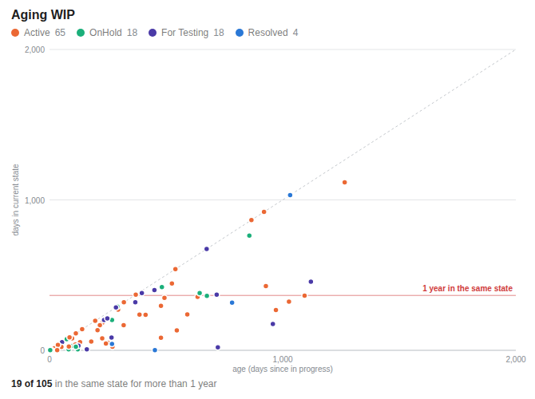

# Aging WIP

See at a glance which work items are getting old and which are stuck. Each dot is an open work item: the horizontal axis shows how long ago work on it started (days since it first entered an in-progress state), the vertical axis how many days it has spent in its current state.

- Dots near the dashed diagonal have not changed state since work started.
- Dots above the red line have been in the same state for longer than the chosen threshold (a year by default).
- Hover a dot for details, click it to open the work item.

## Where to find it

- **Boards → Aging WIP**: pick a team, work item types, states and threshold. The legend shows counts per state (click to hide one), and a table lists every item, longest in its current state first.
- **Dashboard widget**: add **Aging WIP** from the widget catalog, in sizes from 2×2 to 6×4, and configure team, types, states and threshold.

Works with Agile, Scrum, CMMI, Basic and inherited processes: states are read from your process, and only states in the In Progress and Resolved categories are offered.

## Privacy

The extension only reads work items with your own permissions and never writes to Azure DevOps. It has no backend and sends no data anywhere. See the [privacy policy](https://github.com/tomaszzelezny/azure-devops/blob/main/PRIVACY.md).

## Support

Questions and bug reports: [GitHub issues](https://github.com/tomaszzelezny/azure-devops/issues).
